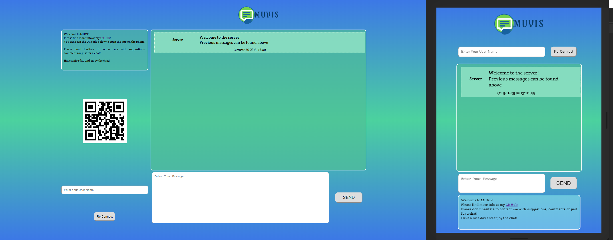

# MUVIS

The Multi-User Various Input Sharer, or lovingly - MUVIS, app is a live chat app created for the ["tech-talk"](https://www.meetup.com/CodeChrysalis/events/266579089/), where I explain the basics of Live Web and WebSockets, and discuss their pros and cons.
Upon connection you need to specify your user-name, which can be anything you want (take care though, names that are too long, will make the message boxes quite large).
After this, type in any message into the input field and youa re good to go!

At this moment there is no persistent storage, so upon connection, the new user will receive the last messages in the current memory (max 19 messages).

Depending on the width of the fieldview, the app rearranges the available components.
In Desktop view, it has a QR code that would allow you to open it on mobile in an instant.

The whole talk can be found on this [stream: TBA]() 

## Used Technology

The front end for this app is pulled together using React.

Back-end is started on Node.js (Express Server). The connection is established using websockets. 

## PRODUCTION ZONE

If you want to deploy the current version, or see how it works, you can use the production version currently available.

### **Available Scripts**

The live demo can be found on [Heroku](https://muvischat.herokuapp.com/)

To play around with the source, code, fork and clone the repo. 

### For both production and development, amke sure to use `npm install` or `yarn` first to isntall all the dependencies!

In the project directory, you can run:

### `yarn start` || `npm run start`

Runs the server in production mode. The server serves the initial page. 
Open [http://localhost:5000](http://localhost:5000) to view it in the browser.

If this is your first time running the app, make sure that you build it first. 

### `yarn build` || `npm run build`

Builds the app for production to the `build` folder. 
It correctly bundles React in production mode and optimizes the build for the best performance.

The build is minified and the filenames include the hashes. 
Your app is ready to be deployed!

## DEVELOPMENT ZONE

If you want to try changing settings, or play around with the code, please use the below commands.
Similar to Production zone, make sure you install all dependencies first.

### `yarn serve` || `npm run serve`

Runs the server in development mode. This enables hot-reloading when you make changes. 
Open [http://localhost:5000](http://localhost:5000) to view it in the browser.

If you want to run only server in development mode, make sure that the front-end is of the latest build.

### `yarn dev` || `npm run dev`

Builds the app in memory and serves the front-end on a specified server. 
Enabling this mode allows for hot-reloading on save for any changes made to the React Components.

### FULL-DEV Mode

To Enable full dev mode, you need to run both the `serve` and `dev` commands (preferably in separate terminals).  
This will allow to have hot-reloading on save both the server components and the React components.

In this case, make sure that the `proxy` adress specified in the `package.json` file matches the server adress that is set by the `serve` command.

### DANGER ZONE: `yarn eject` || `npm run eject`

**Note: this is a one-way operation. Once you `eject`, you can’t go back!**

If you aren’t satisfied with the build tool and configuration choices, you can `eject` at any time. This command will remove the single build dependency from your project.

Instead, it will copy all the configuration files and the transitive dependencies (Webpack, Babel, ESLint, etc) right into your project so you have full control over them. All of the commands except `eject` will still work, but they will point to the copied scripts so you can tweak them. At this point you’re on your own.

You don’t have to ever use `eject`. The curated feature set is suitable for small and middle deployments, and you shouldn’t feel obligated to use this feature. However we understand that this tool wouldn’t be useful if you couldn’t customize it when you are ready for it.

## Future Plans

While the current version is a nice example of all the technologies I wanted to show and explain during the techtalk, I plan to proceed working on this app, and implement additional features that might will showacase the power of the "live" internet even better.

Plans:

 * Adding a user authentification system.
 * Making the messages and user data persistent (plan on using MongoDB)
 * Adding/swapping channels.
 * Sending private messages.
 * Sending images and files.

 A separate feature I am really interested in adding is the ability to draw on a canvas and for users to be able to share that in real-time, as well as add their own makrs as well.

## Afterthought

This whole project was very interesting and full of learning opportunities. 
I learned a lot not only about websockets, but http requests, OSI model and the topic of live internet in general. 
As such, I definitely plan to pursue more knowledge in these fields, and try out other neighbouring technologies like webRTC.

Do not hesitate to contact me @ igor.m.byak@gmail.com if you have any comments, suggestions or requests!